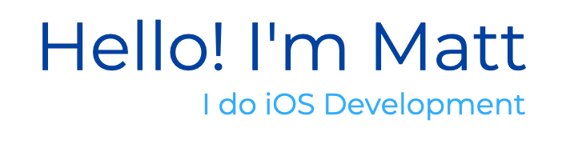

 

## About me:
I'm an iOS Developer based in Philadelphia with a background in IT. 

About two and a half years ago, I made the decision to switch career paths and enrolled in [Flatiron's Software Engineering Bootcamp](https://flatironschool.com/courses/coding-bootcamp/). Since graduating, I have eagerly applied my newfound knowledge towards pursuing mobile development, where I quickly developed a dedication to building in iOS. 

After following many YouTube videos and Udemy courses, I started my career as a developer at [Rave](https://ravebizz.com), an IT consulting company. There, I sharpened my skills by working on both in-house projects and client-focused solutions, and gained in-depth knowledge in the field of mobile development.

I then was offered a contract role by [TIAA](https://apps.apple.com/us/app/tiaa/id341447597) as an iOS Developer for their mobile application team.
My time spent on their agile scrum team for the last year has been an invaluable experience. During my time there we delivered a new feature that spanned the development life cycle; i.e., project initiation, design, development, testing, and deployment. I would say I had the most fun working on our in-house framework and building out robust SwiftUI atomic components which we integrated throughout the app. Overall, my experience at TIAA has further solidified my enthusiasm for iOS development and my desire to continuously improve my skills and knowledge in the field.

Right now I am working on builidng and deploying my first app to the App store and am eager to take on new challenges and opportunities.

 

### Currently I am working on:

👨🏻‍💻 Advanced Programming with Swift, Course 6 of 12 in a Meta iOS Professional Developer Certificate offered through Coursera.
https://www.coursera.org/professional-certificates/meta-ios-developer 🟩🟩🟩🟩🟩🟩⬛️⬛️⬛️⬛️⬛️⬛️

👨🏻‍💻 Expanding my knowledge on Firebase, Combine, and Coordinator Architecture through [Kodeco](https://www.kodeco.com) and [Udemy](https://www.udemy.com/).

👨🏻‍💻 Personal side project to build and deploy my first app to App store

👨🏻‍💻 Documenting my journey and experiences in iOS development by writing technical blogs on [Medium](https://medium.com), where I share my insights and lessons learned, as well as discuss new technologies, best practices, and case studies in the field
 
https://medium.com/@ogtongm

👨🏻‍💻 Contributing to open source on [Codecademy Docs](https://github.com/Codecademy/docs) where I write and update documentation focusing on iOS development and SwiftUI.

👨🏻‍💻 Solving Leetcode problems and documenting progress & solutions in a [repository](https://github.com/matthewogtong/LeetCode-Swift) with added Solution Details. 
 
- 💬 Ask me about: **iOS development, working on exciting projects, and asking what's up**

- 📫 You can reach me at: **ogtongm@gmail.com**

- 🏓 Outside of work: **I enjoy bouldering and table tennis**

<h3 align="left">Connect with me:</h3>

<h3 align="left">Languages and Tools:</h3>

  
<!-- Strongest -->

<!-- Intermediate -->  
 

 

Icons by <a target="_blank" href="https://icons8.com">Icons8</a>

