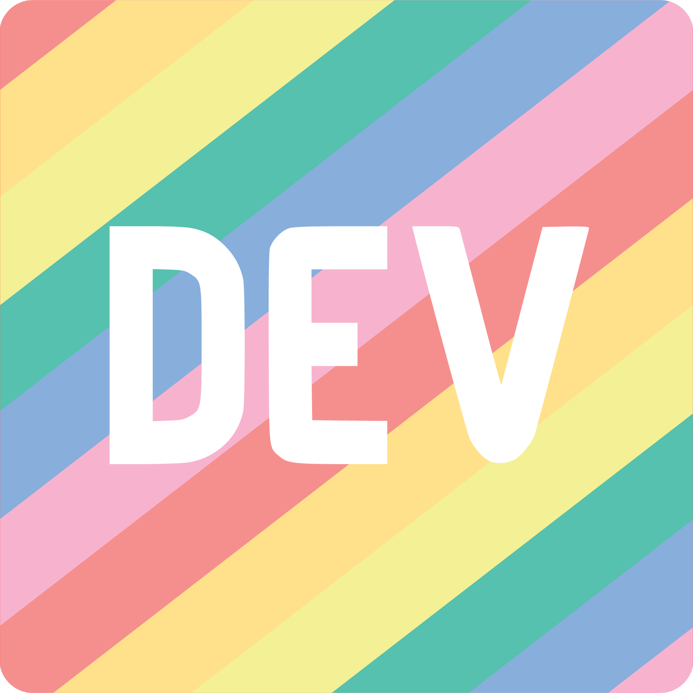

 

## Hi! 👋 :
I'm an enthusiastic iOS developer who is deeply invested in Apple's ecosystem. Embracing a growth mindset, I am always eager to learn, adapt, and evolve.

Two years ago, I graduated from [Flatiron's Software Engineering Bootcamp](https://flatironschool.com/courses/coding-bootcamp/) and embarked on an exciting journey in mobile development, with a keen focus on Apple's mobile platform. My passion lies in mastering the intricacies of iOS SDKs and their capabilities, and I'm currently obsessed with mastering [SwiftUI](https://developer.apple.com/xcode/swiftui/) to create intuitive and visually appealing apps. As I continue to diligently pursue my career in this realm, I am dedicated to honing new skills and staying current with industry advancements.

As part of my ongoing journey, I share my experiences, insights, and discoveries through being an active contributor to [Codecademy Docs](https://github.com/Codecademy/docs) and Content Writer on [Medium](https://medium.com/@ogtongm) and [Dev.to](https://dev.to/matthewogtong).

Github: https://github.com/matthewogtong
 
Medium: https://medium.com/@ogtongm
 
Dev.to: https://dev.to/matthewogtong

🕊️**Open to collaborations and discussions focused on SwiftUI development and open-source contributions**

🧗🏓 **When I'm not glued to my devices, I actively enjoy bouldering and table tennis**

💬 Talk to me about: **iOS development, working on exciting projects, and asking what's up**
 

<h3 align="left">Connect with me:</h3>

<h3 align="left">Languages and Tools:</h3>

  
<!-- Strongest -->

<!-- Intermediate -->  
 

 

Icons by <a target="_blank" href="https://icons8.com">Icons8</a>

